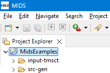
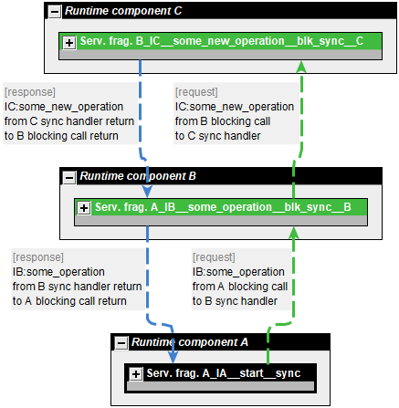
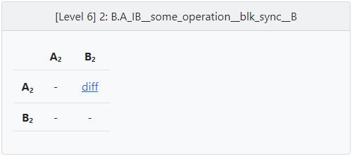
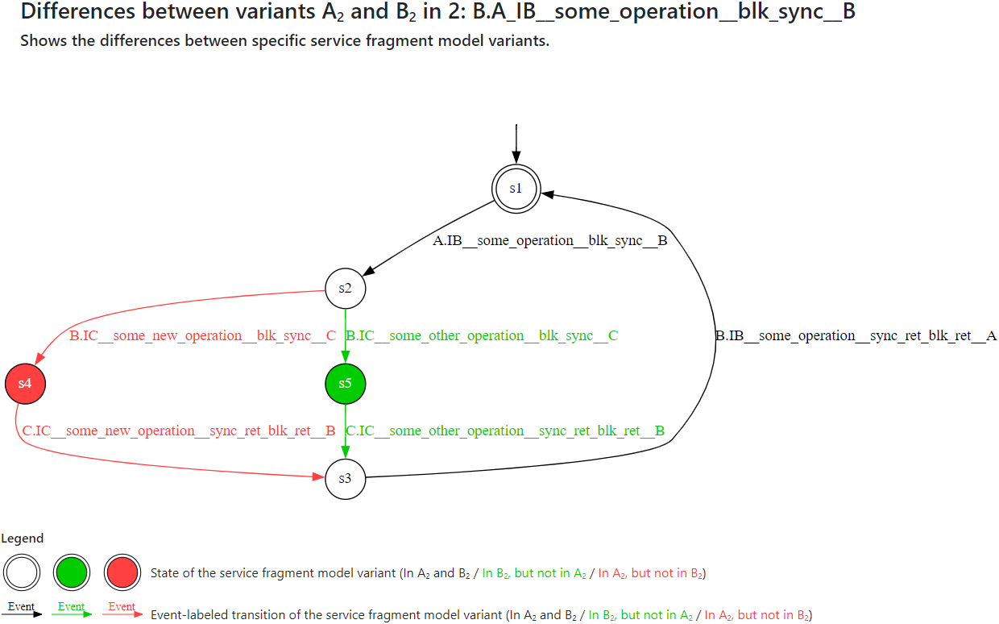

# Simple first example

We will look at a simple first example of the use of MIDS.

## Get MIDS

* Downloads MIDS from the [MIDS download page](https://tno.github.io/MIDS/).

* MIDS is portable.
  Extract the downloaded archive to a folder where you have write permissions.
* Put the MIDS `bin` directory in your `PATH`.

* Make sure you don't forget to install the mandatory and optional [dependencies](https://tno.github.io/MIDS/#dependencies) and to make the mandatory ones available on your `PATH`.

## Start MIDS
* Execute `mids.exe` (Windows) or `mids` (Linux). This starts the MIDS IDE, that we will use for this example.

* You will be asked for a workspace directory in which your project files and settings will be stored.
  The default typically suffices.
  Optionally, select *Use this as the default and do not ask again*.
  Click *Launch* to start MIDS.

* Once the MIDS IDE has started, you will see the *Welcome* screen.

## Prepare for the example

* On the *Welcome* screen, click *Import MIDS examples*.
  In the wizard, click *Finish*.
  The new project can be found in the *Project Explorer*:

  

* The *Welcome* screen has been moved to the right side.
  You may close it now:

  

  You can always reopen the *Welcome* screen by opening the *Help* menu and choosing *Welcome*.

## Infer and view behavioral models

* Infer a model for *input1.tmsc*:

  * Right click the *input1.tmsc* file in the *src-gen* folder and choose *Construct CIF models* and then *Construct component models*.

  * Enable the *Save models as yEd diagrams* option.

  * Disable the *Create separate CIF model per component* option.

  * Click *OK* to infer the model.

  * After a short wait, a folder named *input1* appears within the *src-gen* folder, which contains the inferred model.

* Similarly, infer a model for *input2.tmsc*.

* Expand the *input1* folder to find a file named *allComponents.graphml*.
  If you've installed yEd (one of the optional dependencies of MIDS) you can open this file in yEd.
  Depending on how you installed yEd, it may be sufficient to double click the file in MIDS.

* In yEd, open the *Layout* menu and choose *One-Click Layout*, or select the corresponding item from the toolbar.
  You'll see something like this:

  

  You see the components of the system, their service fragments, and the messages they exchange.

* You can expand the service fragments by clicking on their '+' icons.
  Then perform the One-Click Layout again,and you'll see something like this:

    

  You now additionally see the state machines within the service fragments, which allow you to understand their detailed behavior.
  You can also see the execution flow through the system.

## Perform a comparison and inspect the results

* Prepare the input files:

  * Right click the examples project choose *New* and then *Folder*.
    Type `input-compare` and click *Finish*.

  * Copy the *input1.tmsc* and *input2.tmsc* files from the *src-gen* folder to the *input-compare* folder:

    * Select *input.tmsc* by clicking on it.

    * While holding the *Ctrl* key on your keyboard, click the *input2.tmsc* file.

    * Right click any of the two files and select *Copy*.

    * Right click the *input-compare* folder and select *Paste*.

  * Infer models for *input1.tmsc*:

    * Right click the *input1.tmsc* file in the *input-compare* folder and choose *Construct CIF models* and then *Construct component models*.

    * Click *OK* to infer the models.

    * After a short wait, a folder named *input1* appears within the *input-compare* folder, which contains the inferred models.

  * Similarly, infer models for *input2.tmsc*.

* Perform the comparison:

  * Right click the *input-compare* folder and choose *Compare CIF models*.

  * Click *OK* to perform the comparison.

  * Wait for the comparison to complete and a folder named *output* to appear in the example project.

* Inspect the compare results:

  * In the *output* folder, there is an *index.html* file.
    Right click that file and choose *Open With* and then *Web Browser*.
    Your system browser is opened to show the compare results overview:

    

  * Click the *View* button for *Level 1*.

  * A new page opens in the browser with the level 1 results:

    

    It indicates that the two sets of input models have different behaviors:

  * Close the browser tab to return to the compare results overview.

  * Click the *View* button for *Level 4*.

  * A new page opens in the browser with the level 4 results:

    

    It indicates that the *A.A_IA__start__sync* service fragment has the same behavior in both model sets.
    The *B.A_IB__some_operation__blk_sync__B* service fragment has different behavior in both model sets.
    The *C.B_IC__some_new_operation__blk_sync__C* service fragment is only present in the second model set.
    The *C.B_IC__some_other_operation__blk_sync__C* service fragment is only present in the first model set.

  * Close the browser tab to return to the compare results overview.

  * Click the *View* button for *Level 6* and select the *2: B.A_IB__some_operation__blk_sync__B* item.

  * A level 6 view is shown at the bottom:

    

  * Click the *diff* link to compare variants *A2* and *B2* variants.

  * A new page opens in the browser with the level 6 results for this second service fragment:

    

    It shows that a different operation is performed in the new version compared to the old version.

## Next steps

* To learn more about the features of MIDS, how to use MIDS, and more, check out the [MIDS user guide](https://tno.github.io/MIDS/userguide).

* To start with your own models, create a new empty project from the *Welcome* screen.
